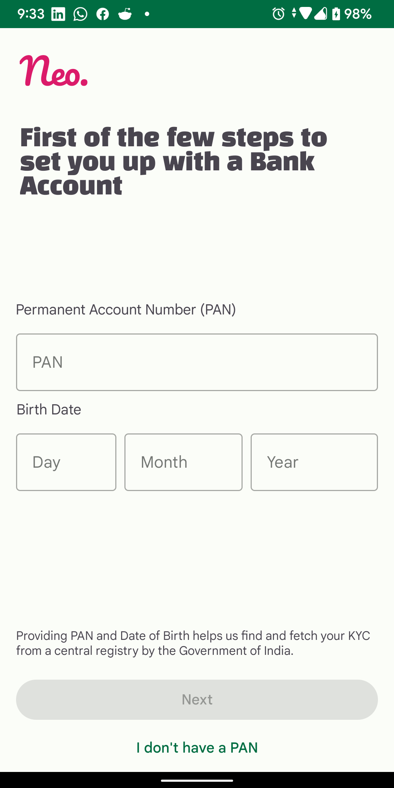
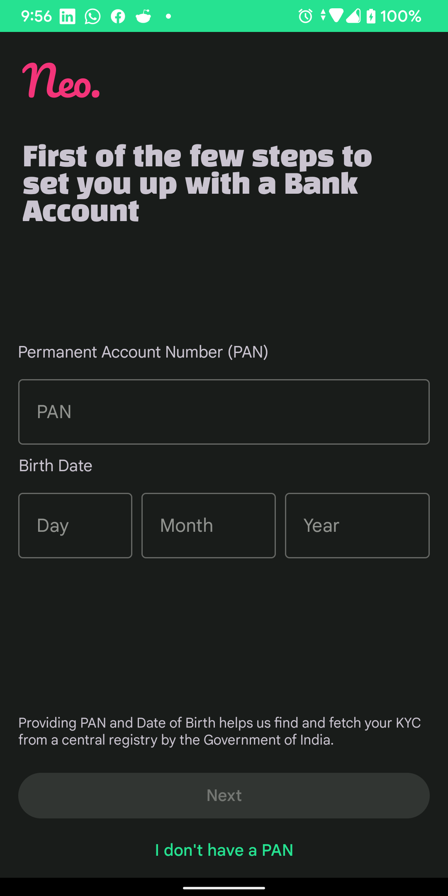

# Neo-Bank-App

A simple app to take PAN and Date of Birth from User, validate and allow to submit if all is valid.

The validations exist per input field i.e. PAN, day, month, year, and date of birth as whole.

If the user does't have PAN, they can choose to skip via 'I don't have a PAN' button.

As the input screen includes user's PII(PAN and date of birth), the activity window is masked from taking screenshots i.e. screenshots or screen recorders will find a blank screen on this particular activity.

The UI is designed using constraint layout and is currently only supporting portrait orientation on phones and tablets. Any other aspect ratio or screen resizing may affect the UI elements.1

The UI also uses Material3, along with dark mode support.

There are unit tests for validations in place.

Screensnip (example)

 
